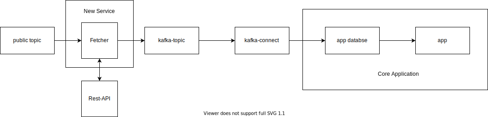
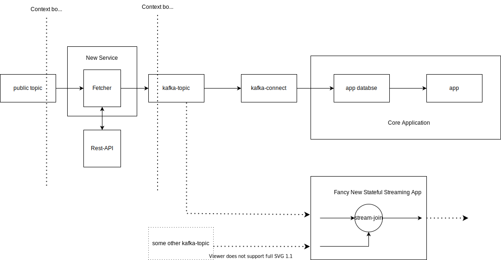
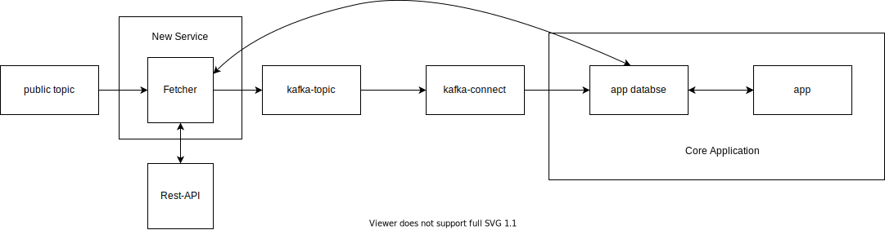
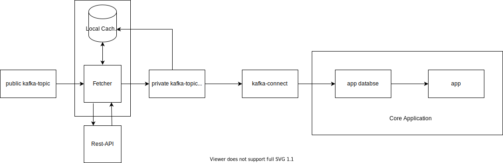

## A surefire way to a distributed monolith: And how to avoid it.

##### TLDR

 - Don't share mutable state across multiple services.
 - Kafka and Kafka-Streams provide the right features to avoid sharing mutable state: topics and [ktables](https://kafka.apache.org/20/documentation/streams/developer-guide/dsl-api.html#streams_concepts_ktable).

---

Recently one of our components caused some headache due to some unnecessary coupling through a shared database.
Here is what happened.

### The happy stateless life
In the beginning there was this stateless data flow and life was good.



From left to right: Whenever an event gets published on the public topic the service called 'Fetcher' consumed it.  
It's job was to fetch some additional reference data from an external rest service and send the enriched data off to the next topic.
It publishes the id used to fetch from the external rest service as the records key and the enriched entity as the records' payload.
That's it, this was the boundary of this service.
It did not know or care who consumed the enriched data.

Setting this boundary here meant that we made it possible for ourselves to freely extend the overall topology of the flow.
For example, instead of just persisting the data into the database of our batch-job-app (Core Application) we could extend the topology with an additional application (see the illustration below).
This component would simply subscribe to the kafka-topic and do its thing in isolation.
None of the existing components would have to be changed / redeployed for this.
With this setup we could attempt providing a more real time implementation for one of our batch jobs.
We would only switch over once we have reconciled both outputs for some time in production.

[//]: # (In general, you would like to avoid having to fetch&#41; https://stackoverflow.com/questions/52366623/how-to-process-data-in-chunks-batches-with-kafka-streams&#41;)




### And then state came along

However, mistakes were made.
At some point the requirement came to only fetch data for a given id which has not been fetched before.
Unfortunately, the solution for this was to tap the currents consumers data store to retrieve the information about whether some data has been fetched for a certain id or not.
This dependency is illustrated with the long arching arrow from the 'Fetcher' to the 'app database'.



Just by looking at the drawing you can tell that something is off.
This dependency has the following implications:

- Changes to the db schema need to be coordinated across two apps.
- If we decide to abandon the current batch flow for some other application (e.g. 'Fancy New Stateful Streaming App') we would still have to maintain the app's db schema - The core application is the owner and maintainer of the db schema. 
- In order to deploy a new version of the 'Fetcher' we most likely have to deploy the core application too.
- In short: these two components have been turned into distributed monolith by sharing mutuable state.

### How to avoid it.

Don't share mutable state across apps. Done.

I guess there are many ways to store such a simple thing like a set of ids you have already used to query some endpoint.
The important part is that no mutable state is shared.
However, I would like to illustrate a '*kafkaish*' way on how to decouple these two apps as it has some additional features.
It is illustrated in the drawing below.



Instead of tapping another applications datastore the 'Fetcher' subscribes to its own topic ('kafka-topic').
This way it can keep track of the id's it published.
It maintains a local cache based on what is being published on the topic.
I suggest leveraging kafka streams [ktable](https://kafka.apache.org/20/documentation/streams/developer-guide/dsl-api.html#streams_concepts_ktable) abstraction to do the local caching.
It comes with many useful defaults and the coding required is kept to a minimum.

It is important that the kafka-topic is configured with ```cleanup.policy=compact```.
This tells the kafka broker to retain the latest record for a given key on this topic.


This setup has the following advantages:

- Mutable state is no longer shared across apps
- The 'Fetcher' app does not need to do round trips to the database to check the set of already requested ids. The set of ids is cached in memory or on disk.
- The 'Fetcher' app syncs itself with the facts it publishes: no split brain between what it publishes and what it maintains internally.
- If the local cache gets lost due to an application or server crash then it can be recovered by reprocessing the topic.
- Likewise, if you run the 'Fetcher' on kubernetes or similar then it can recover its state when the pod gets moved somewhere else in the cloud: No need for an expensive persistent volume claim.

Of course there are also drawbacks:

- Your kafka admin might not like it if the payload of your records is huge. However, they probably have means to limit the size of a topic.
- The bigger your topic gets the longer it will take to restore the local cache.
- ...

